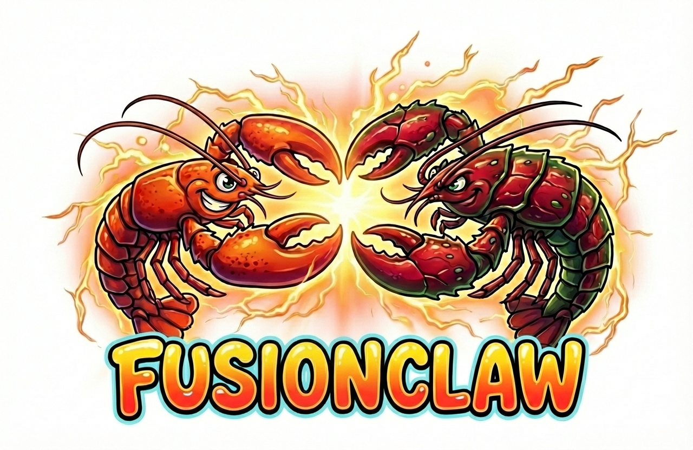

# FusionClaw



**Context fusion beats agent chat.**

Multi-agent systems today make agents *talk* to each other — generating tokens to explain what they know, passing summaries back and forth. This is slow, lossy, and expensive. By the time Agent C hears from Agent A (through Agent B's paraphrase), critical details are gone.

FusionClaw takes a different approach: **merge agent context windows directly**. No chatting. No summarization hops. Each agent exports structured state, and the fuser combines them into a single context window for one synthesis call.

## Why This Matters

| | Agent Chat (CrewAI, AutoGen, etc.) | Context Fusion (FusionClaw) |
|---|---|---|
| **Information flow** | Lossy — each hop compresses via natural language | Lossless — raw context merged directly |
| **Speed** | Sequential — agents take turns generating | Parallel — all agents run simultaneously |
| **Cost** | N+1 LLM calls minimum | 1 LLM call for synthesis |
| **Debugging** | Read 50 pages of chat logs | Inspect structured state objects |

## How It Works

```
                    ┌─────────┐
                    │  Query  │
                    └────┬────┘
                         │
                    ┌────▼────┐
                    │Orchestr.│
                    └────┬────┘
                    ┌────┴────┐
               ┌────▼──┐  ┌──▼────┐
               │Claw A  │  │Claw B │  ← run in parallel
               │(state) │  │(state)│
               └────┬───┘  └──┬────┘
                    │  StateObj │
                    ▼          ▼
               ┌───────────────────┐
               │   Context Fuser   │  ← merge, not chat
               └────────┬──────────┘
                        │
               ┌────────▼──────────┐
               │  Single LLM Call  │  ← one synthesis pass
               └────────┬──────────┘
                        │
                    ┌───▼────┐
                    │ Answer │
                    └────────┘
```

1. **You define claws** — specialist agents that do one thing well
2. **Each claw exports a `StateObject`** — structured data (summary, key facts, raw context), not chat messages
3. **The fuser merges them** — into a single context window, handling overflow via compression
4. **One LLM call synthesizes** — the answer from the full fused context

## Quickstart

```bash
pip install -e ".[dev]"
cp .env.example .env
# Edit .env with your OpenAI API key
```

```python
import asyncio
from fusionclaw import BaseClaw, Fact, Orchestrator, StateObject

class PricingClaw(BaseClaw):
    claw_id = "pricing"
    description = "Analyzes competitor pricing"

    async def run(self, input: str) -> StateObject:
        # Your research/analysis logic here
        return StateObject(
            claw_id=self.claw_id,
            summary="Competitor cut enterprise pricing 15%",
            key_facts=[Fact(key="new_price", value="$85/mo")],
            raw_context="...full research notes...",
            token_count=1200,
        )

class FeaturesClaw(BaseClaw):
    claw_id = "features"
    description = "Analyzes competitor product features"

    async def run(self, input: str) -> StateObject:
        return StateObject(
            claw_id=self.claw_id,
            summary="Competitor shipped AI copilot and SOC 2",
            key_facts=[Fact(key="ai_model", value="Claude 3.5 Sonnet")],
            raw_context="...full product analysis...",
            token_count=800,
        )

async def main():
    orch = Orchestrator(claws=[PricingClaw(), FeaturesClaw()])
    result = await orch.query("How does this competitor threaten us?")
    print(result.answer)

asyncio.run(main())
```

That's the entire API. Subclass `BaseClaw`, pass to `Orchestrator`, call `.query()`.

## Benchmark Results

Same task. Same data. Same LLM. Chat vs fusion.

| Metric | Agent Chat | Context Fusion | Delta |
|---|---|---|---|
| **Total tokens** | 5,267 | 2,954 | **-44%** |
| **Wall time** | 33.1s | 14.8s | **-55%** |
| **LLM calls** | 3 | 1 | **-67%** |
| **Est. cost** | $0.0289 | $0.0114 | **-60%** |
| **Facts retained** | 5/10 | 7/10 | **+40%** |
| **Quality (1-10)** | 9.0 | 9.0 | 0% |

> Tested with `gpt-4o-mini` via OpenRouter. Task: competitive analysis using two specialist claws (pricing + product research). Run the benchmark yourself — see below.

Fusion uses fewer tokens, runs faster, costs less, and retains more facts from the source data. Quality is the same because the synthesizer gets the full raw context instead of a lossy summary chain.

## Run the Benchmark

```bash
pip install -e ".[benchmark]"
python -m benchmarks.run_benchmark --model openai/gpt-4o-mini
```

Options:
```bash
python -m benchmarks.run_benchmark --model openai/gpt-4o-mini --runs 3    # average over 3 runs
python -m benchmarks.run_benchmark --model openai/gpt-4o --no-judge       # skip quality judging
python -m benchmarks.run_benchmark --query "What is their pricing strategy?"  # custom query
```

### What It Measures

- **Total tokens** — input + output across all LLM calls
- **Wall time** — end to end
- **LLM calls** — fewer = cheaper + faster
- **Estimated cost** — based on model pricing
- **Fact retention** — how many specific facts from the source data appear in the final answer
- **Quality** — LLM-as-judge scoring (1-10)

### How the Benchmark Works

**Chat Baseline** (how multi-agent frameworks work today):
1. Claw A summarizes its research → LLM call #1
2. Summary sent to Claw B, which combines it with its own research → LLM call #2
3. Combined summary sent to synthesizer → LLM call #3

3 sequential LLM calls. Information degrades at each hop.

**Fusion Approach** (FusionClaw):
1. Both claws export structured state (parallel, no LLM call)
2. Fuser merges contexts → single synthesizer LLM call

1 LLM call. Full context preserved.

## Overflow Handling

When merged contexts exceed the token budget (default: 120k), the fuser applies compression:

- **Under budget**: full `raw_context` from all claws merged (100% fidelity)
- **Over budget**: lowest-priority claws fall back to `summary` + `key_facts` only (drops raw context)
- **Way over budget**: facts-only mode (last resort)

Each block is tagged with its compression level so the synthesizer knows what's full vs. compressed. You can set priorities per-claw:

```python
result = await orch.query("my question", priorities={"critical_claw": 10, "nice_to_have": 1})
```

## Configuration

```python
orch = Orchestrator(
    claws=[...],
    model="gpt-4o",              # any OpenAI-compatible model
    token_budget=120_000,         # max fused context size
    base_url="https://...",       # OpenRouter, local models, etc.
    api_key="sk-...",             # or set OPENAI_API_KEY env var
)
```

## Project Structure

```
fusionclaw/
  fusionclaw/
    models.py         # StateObject, Fact, FusedContext, etc.
    claw.py           # BaseClaw abstract class
    fuser.py          # ContextFuser with overflow handling
    orchestrator.py   # Orchestrator (the main entry point)
  benchmarks/
    fixtures/         # Pre-loaded research data for deterministic benchmarks
    chat_baseline.py  # Chat-based multi-agent approach
    fusion_approach.py# Context fusion approach
    run_benchmark.py  # Harness that runs both + prints comparison
  tests/
    test_models.py    # Model validation tests
    test_fuser.py     # Fusion logic + compression tests
    test_claw.py      # BaseClaw interface tests
  examples/
    quickstart.py     # Minimal working example
```

```bash
# Run tests
python -m pytest tests/ -v
```

## Future Roadmap

- **v0.2** — Embedding-based claw registry (auto-discover relevant claws), priority weights, deeper compression tiers
- **v0.3** — Combinatory claws (spawn new agents from fused context, recursive fusion)
- **v0.4** — Real-world claws (web search, code analysis, MCP integration)
- **v0.5** — Benchmark suite (more scenarios, N-claw scaling, cross-model comparison)
- **v0.6** — K/V cache sharing (skip text, merge raw model state — true agent telepathy)
- **v1.0** — Production (auth, claw marketplace, observability, JS/TS SDK)

## License

MIT
